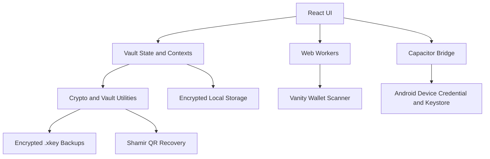

# xKey Architecture Overview

xKey is a local, offline-first Web3 wallet vault built to manage wallet records, private keys, seed phrases, folders, tags, encrypted backups, Shamir QR recovery, local audit history, and advanced offline vanity wallet generation.

The architecture prioritizes local control, explicit secret handling, and a release pipeline that can build Android artifacts from signed git tags.

---

## 1. Technology Stack

- **UI:** React
- **Build tool:** Vite
- **Native bridge:** Capacitor 8
- **Android package:** `com.haivcon.xkey`
- **Storage:** Capacitor Preferences plus application-level encryption wrappers
- **Cryptography:** Web Crypto API, CryptoJS utilities, and Android Keystore integrations where available
- **Workers:** Web Workers for CPU-heavy jobs such as vanity wallet generation
- **Testing and verification:** ESLint, TypeScript, focused wallet/security tests, Vite build, and Capacitor Android sync

---

## 2. Runtime Architecture



The UI never depends on a custody server. User data remains local unless the user manually exports it.

---

## 3. Authentication and Key Handling

xKey does not use a traditional hosted account model.

1. A vault key is generated or restored locally.
2. On Android, the vault key can be protected by Android Device Credential and Android Keystore capabilities.
3. On web fallback builds, security depends on browser storage and the local device environment.
4. Sensitive fields such as private keys and seed phrases are treated as secret material and revealed only through explicit UI actions.
5. If Android device security changes and hardware-protected keys become unavailable, the user must restore from a valid backup or reset the vault.

---

## 4. Storage, Backup, and Recovery

- Vault data is encrypted before persistence.
- `.xkey` backups are encrypted portable containers controlled by the user.
- Backup metadata and tamper-aware structures support safer restore workflows.
- Shamir Secret Sharing QR recovery can split recovery material into shares for offline storage.
- Reed-Solomon resilience is used in backup/storage flows where corruption recovery is supported.
- xKey cannot recover user data without the required key, backup password, or recovery shares.

---

## 5. Source Organization

The React source is organized around clear application boundaries:

- `src/App.tsx` owns the top-level vault shell and app-wide orchestration only.
- `src/app/` contains app-level constants, shared value formatters, and app-wide TypeScript contracts.
- `src/components/` contains reusable UI components and feature UI modules.
- `src/components/backup-import/` contains backup import modal UI; import analysis/pure logic stays outside UI.
- `src/components/create-wallet/` contains the create-wallet feature module:
  - `index.tsx` is the feature container and UI composition entry point.
  - `components.tsx` contains extracted sub-components used within the create-wallet modal.
  - `types.ts` contains feature-local models and prop contracts.
  - `constants.ts` contains create-wallet and vanity generation constants.
  - `formatters.ts` contains display formatting helpers.
  - `vanityPreview.ts` contains deterministic vanity filter preview builders.
- `src/contexts/` contains cross-cutting React contexts.
- `src/features/` contains feature-domain logic that should be testable without React:
  - `src/features/import/fileImportParsers.ts` contains CSV/JSON/text import parsing and normalization.
  - `src/features/import/backupImportAnalysis.ts` contains backup import fingerprinting and preview analysis.
- `src/hooks/` contains reusable React hooks and extracted orchestration hooks:
  - `useVaultAuth` owns vault bootstrap, biometric/PIN fallback unlock, decoy-mode unlock state, and vault lock reset.
  - `useStartupIntegrity` owns splash-time integrity checks and startup failure state.
  - `useKeyHealthFlow` owns proof-of-keys checks, key-health summaries, wallet patching, persistence, and audit logging.
  - `useBackupExport` owns backup export confirmation, modal state, and backup verification trigger handoff.
  - `useFolderEditing` owns folder edit modal state and folder delete cleanup.
  - `useFileImport` owns file picker/external-open orchestration, while parsing/analysis helpers live under `src/features/import/`.
  - `useExternalBackupOpen` owns native file-open intent listening and deduplication for external `.xkey` file intents on Capacitor platforms.
  - `useAssetBalanceSettings` owns asset unit preference persistence and batch wallet-balance save logic.
  - `useBackupVerificationReport` owns backup verification report generation, secure clipboard copy, and audit logging for backup metadata inspection.
- `src/utils/` contains storage, backup, crypto, validation, and domain utilities.
- `src/workers/` contains CPU-heavy worker entry points.

Large files should be split by stable responsibility before adding new features. Prefer extracting pure helpers, feature constants, types, hooks, and leaf UI components first; keep storage/crypto behavior covered by type-checks and focused tests after each move. Pure feature helpers should have focused tests under `tests/` and package scripts when they protect import/export, recovery, key-health, or vanity logic.

---

## 6. Vanity Wallet Generator

The vanity generator runs as an offline CPU-bound workflow.

### Current behavior

- Organized into a professional 5-step UI wizard while retaining the expandable structure.
- Features unified visual status badges for quick configuration verification.
- Implements progressive UI state tracking for better user orientation.
- Scans for user-provided vanity targets.
- Keeps additional mathematically interesting secondary matches.
- Detects patterns such as forward/reverse sequences, dual-end repetitions, symmetry, palindromes, alternating groups, and bracket-style endings.
- Shows expanded scrollable result lists with middle-truncated addresses for better prefix/suffix visibility.
- Keeps generated private keys and seed phrases hidden until the user explicitly reveals them.
- Supports individual saves, bulk saves, and direct folder routing.
- Allows a bounded secondary reserve limit to control memory usage.
- Displays CPU heat and battery-health guidance for long-running scans.

### Safety constraints

- No generated secret should be transmitted to a remote service.
- Secret reveal/copy must remain explicit.
- Long-running scans should stay pausable/stoppable.
- Memory usage must remain bounded.
- Users must receive clear heat and device-health warnings.

---

## 7. Offline-First Constraints

xKey development should preserve these constraints:

- No hidden telemetry.
- No cloud sync by default.
- No custodial key storage.
- No remote key recovery.
- No background upload of vault data, private keys, seed phrases, backups, or vanity scan results.
- Manual export/import for backups.
- Clear warnings before secret display, copy, export, or recovery actions.

---

## 8. Android Build Metadata

For v5.21.0:

- `package.json` version: `5.21.0`
- Android `versionName`: `5.21.0`
- Android `versionCode`: `85`
- Android package: `com.haivcon.xkey`

The top-level Android Gradle configuration keeps shared repository and plugin configuration, while `android/app/build.gradle` owns application version metadata and release build settings.

---

## 9. Build and Release Pipeline

Release builds are intended to be triggered by git tags matching `v*`.

Recommended release verification:

```bash
npm run lint
npm run type-check
npm run test:vanity
npm run test:key-health
npm run test:backup-import
npm run build
npx cap sync android
```

Release flow:

1. Update app version metadata and documentation.
2. Run verification commands.
3. Commit only intended source and documentation files.
4. Ensure local-only folders such as `1/` and build artifacts are ignored.
5. Create an annotated tag such as `v5.21.0`.
6. Push `main` and the tag to GitHub.
7. Let GitHub Actions build Android artifacts from the clean tag.

---

## 10. Repository Hygiene

The repository should exclude:

- `node_modules/`
- Web and Android build outputs
- APK/AAB/release artifacts
- Local environment files and secrets
- Playwright/test output folders
- Local instruction or scratch folders such as `1/`

Documentation should keep the current release information prominent while older release notes remain collapsed or summarized.