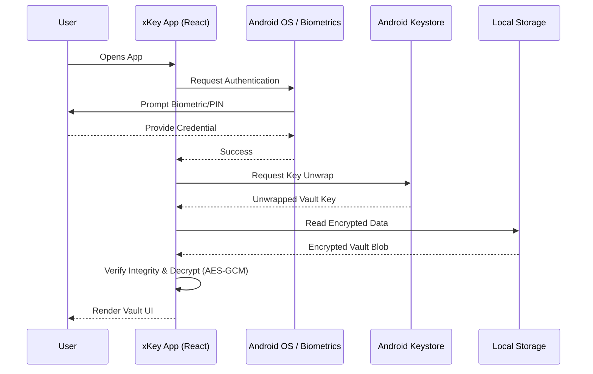

# xKey Architecture Overview

This document provides a high-level overview of xKey's architecture, specifically focusing on its security model, data flow, and cross-platform structure. 

xKey is built as a **local, offline-first Web3 wallet vault**.

## 1. High-Level Tech Stack

- **Frontend:** React (UI components, state management), Vite (bundler)
- **Native Bridge:** Capacitor 8
- **Storage:** Capacitor Preferences (Encrypted via custom wrapper on top)
- **Cryptography:** Web Crypto API, native Android Keystore integrations.
- **Workers:** Web Workers for heavy background tasks (e.g., Vanity Wallet Generation).

## 2. Core Modules

### 2.1. Authentication & Key Management
xKey does not use a traditional username/password system. Access is granted via the device's native security or a fallback mechanism.

1. **Vault Key Generation:** Upon vault creation, a strong random master vault key is generated.
2. **Android Keystore Wrapping (Android Only):** The vault key is wrapped using Android's Hardware-backed Keystore (AES/GCM/NoPadding).
3. **Authentication (Unlock):** 
   - Android prompts the system lock screen (Biometrics, PIN, Pattern).
   - Upon success, the Keystore unwraps the vault key, allowing xKey to decrypt the storage.
4. **Field-Level Encryption:** A derived field key (from the vault key) is used to encrypt highly sensitive specific fields (like private keys and seed phrases) to provide an extra layer of defense.

### 2.2. Storage Resilience (Self-Healing)
xKey employs **Reed-Solomon Error Correction** for vault storage and `.xkey` backups.
- **Sharding:** Data is split into 10 data shards + 5 parity shards.
- **Recovery:** If portions of the backup file or local storage become corrupted, the system uses the parity shards to reconstruct the original data before decryption.

### 2.3. Anti-Tamper & Integrity Guards
- **Startup Guard:** Detects root traces, test-keys, `su` binaries, and ADB status.
- **Tamper-evident Backups:** Backups (`.xkey`) use a container-based format with a readable header, hashed payload, and a recovery footer.
- **Audit Log:** An immutable, hash-chained local audit log records security-sensitive events (unlocks, imports, exports, self-healing events).

## 3. Data Flow Diagram

*(Conceptual representation of the vault unlock and decryption process)*

## 4. Offline First Constraints

To maintain its security posture, xKey enforces strict rules on development:
- **No Telemetry:** No tracking scripts or analytics that could leak IPs or usage times.
- **No Cloud Sync:** Backups are entirely manual and file-based (`.xkey`).
- **No Background execution:** The app auto-locks when put into the background.

## 5. Build and Release Pipeline

- Builds are triggered via GitHub Actions on `v*` tags.
- Android APKs and AABs are signed using a secure Keystore managed in GitHub Secrets.
- Integrity verification keys (`XKEY_INTEGRITY_PUBLIC_KEY_PEM`) are baked into the build to ensure the app manifest and code have not been tampered with post-compilation.
