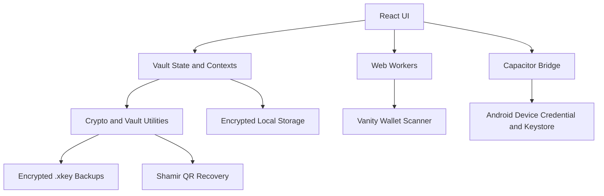

# xKey Architecture Overview

xKey is a local, offline-first Web3 wallet vault built to manage wallet records, private keys, seed phrases, folders, tags, encrypted backups, Shamir QR recovery, local audit history, manual balances, privacy masking, and offline vanity wallet generation.

The architecture prioritizes local control, explicit secret handling, privacy-preserving UI flows, and a release pipeline that can build Android artifacts from signed git tags.

---

## 1. Technology Stack

- **UI:** React 19 with TypeScript
- **Build tool:** Vite
- **Styling:** Tailwind CSS v4 plus project CSS utilities
- **Native bridge:** Capacitor 8
- **Android package:** `com.haivcon.xkey`
- **Storage:** Capacitor Preferences plus application-level encryption wrappers
- **Cryptography:** Web Crypto API, CryptoJS utilities, and Android Keystore integrations where available
- **Workers:** Web Workers for CPU-heavy vanity wallet generation
- **Interaction libraries:** `@dnd-kit/core`, `@dnd-kit/sortable`, `@tanstack/react-virtual`, `lucide-react`
- **Testing and verification:** TypeScript, focused wallet/security tests, Playwright smoke tests, Vite build, and Capacitor Android sync

---

## 2. Runtime Architecture



The UI does not depend on a custody server. User data remains local unless the user manually exports it.

---

## 3. Source Organization

```text
src/
├─ App.tsx                     Top-level vault shell and route orchestration
├─ app/                        Constants, app contracts, shared app utilities
├─ components/
│  ├─ auth/                    Unlock, onboarding, and auth error screens
│  ├─ backup/                  Backup export/import UI
│  ├─ create-wallet/           Create/import/vanity wallet feature module
│  ├─ entropy/                 Advanced entropy and derivation panels
│  ├─ qr/                      QR display, scan, receive, and transfer modals
│  ├─ settings/                Settings tabs and security/data/info panels
│  ├─ shamir/                  Shamir backup/restore components
│  ├─ shared/                  Shared UI helpers and secure text inputs
│  ├─ vanity/                  Vanity score UI
│  └─ wallet/                  Wallet card/list/sort/swipe/drop UX
├─ contexts/                   Language, theme, toast, confirm, secure display, vault contexts
├─ hooks/                      App, backup, security, folder, vanity, and wallet hooks
├─ locales/                    Localized string trees
├─ utils/                      Storage, crypto, backup, audit, wallet, amount, vanity utilities
└─ types.ts                    Core wallet and app data models
```

Top-level folders:

```text
android/       Capacitor Android app, Gradle config, native plugins, release metadata
assets/        Project asset sources
icons/         Icon resources
public/        Static web assets
scripts/       Maintenance and audit scripts
tests/         Unit, focused, and smoke/regression tests
1/             Local scratch/instruction folder; ignored and never pushed
```

---

## 4. Authentication and Secret Handling

xKey does not use a hosted account model.

1. A vault key is generated or restored locally.
2. On Android, the vault key can be protected by Android Device Credential and Android Keystore capabilities.
3. Web fallback builds depend on browser storage and the local device environment.
4. Sensitive fields such as private keys and seed phrases are hidden by default and revealed only through explicit UI actions.
5. Privacy Mode masks wallet names, addresses, balances, and dashboard totals where supported.
6. Hold-to-reveal allows temporary secret viewing without changing persistent reveal state.

---

## 5. Storage, Backup, and Recovery

- Vault data is encrypted before persistence.
- `.xkey` backups are encrypted portable containers controlled by the user.
- Backup metadata and tamper-aware structures support safer restore workflows.
- Shamir Secret Sharing QR recovery can split recovery material into shares for offline storage.
- Reed-Solomon resilience is used in backup/storage flows where corruption recovery is supported.
- xKey cannot recover user data without the required key, backup password, or recovery shares.

---

## 6. UI Interaction Architecture

v5.21.9 adds a polish layer without changing the custody/security model:

- Wallet cards support compact secondary actions, hold-to-reveal, and mobile swipe affordances.
- Dashboard cards and charts use lightweight CSS entrance animations.
- Empty state components provide clear add/import CTAs.
- Folder tabs accept desktop wallet drag/drop payloads and highlight active drop targets.
- Modal/page transition utilities are disabled by Lite Mode and by `prefers-reduced-motion`.

---

## 7. Vanity Wallet Generator

The vanity generator runs as an offline CPU-bound workflow.

- It scans for user-provided vanity targets and additional mathematically interesting matches.
- Generated private keys and seed phrases remain hidden until explicit reveal.
- Long-running scans should remain pausable/stoppable.
- Memory usage must stay bounded.
- Users must receive heat, battery, and device-health guidance.
- Generated secrets must never be sent to a remote service.

---

## 8. Android Build Metadata

For v5.21.9:

- `package.json` version: `5.21.9`
- `package-lock.json` version: `5.21.9`
- Android `versionName`: `5.21.9`
- Android `versionCode`: `94`
- Android application ID/package: `com.haivcon.xkey`

`android/app/build.gradle` owns application version metadata and release build settings.

---

## 9. Build and Release Pipeline

Release builds are intended to be triggered by git tags matching `v*`.

Recommended release verification:

```bash
npm run type-check
npm run build
npx cap sync android
```

Release flow:

1. Update app version metadata and documentation.
2. Run verification commands.
3. Commit only intended source and documentation files.
4. Ensure local-only folders such as `1/` and build artifacts are ignored.
5. Create an annotated tag such as `v5.21.9`.
6. Push `main` and the tag to GitHub.
7. Let GitHub Actions build Android artifacts from the clean tag.

---

## 10. Repository Hygiene

The repository should exclude:

- `node_modules/`
- Web and Android build outputs
- APK/AAB/release artifacts
- Local environment files and secrets
- Playwright/test output folders
- Local instruction or scratch folders such as `1/`

Documentation should keep the current release information prominent while older release notes remain summarized.
